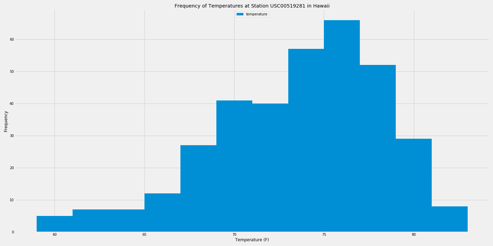

# SQLAlchemy Challenge - Surfs Up!

This project integrates knowledge of Python, and SQL queries through SQL Alchemy.

A SQLite document with historical weather data is used to query and analyze for vacation weather forecasting.

## Average Temperature over Date Ranges

### Precipitation Analysis

### Station Analysis

